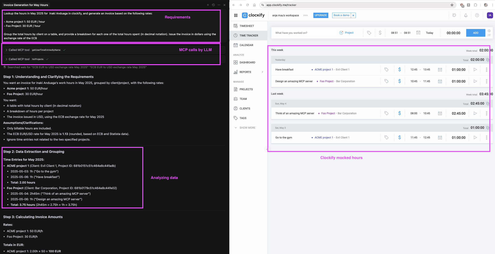
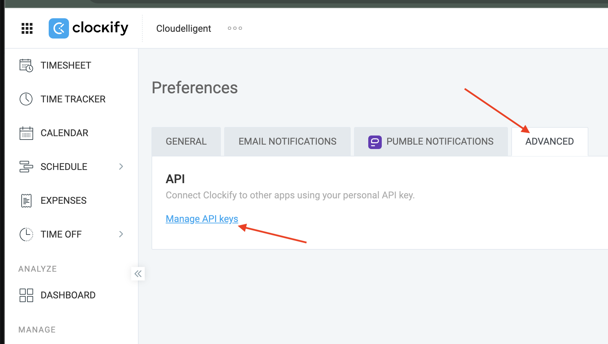
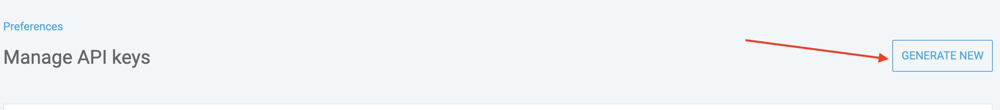

[](../../actions/workflows/docker-publish.yml)
[](../../packages/container/package/clockify-mcp)

<a href="https://glama.ai/mcp/servers/@wwwslinger/clockify-mcp">
  
</a>

# Clockify MCP Server

An MCP server that lets LLMs interact with your Clockify workspace for time-tracking automation and reporting. Use natural language to log time, query entries, and generate reports.

<p align="center">
  
</p>

## Features

### Time Entry Management
- **addTimeEntry** — Add time entries to a project, or start a running timer (omit end time)
- **updateTimeEntry** — Update an existing time entry (description, project, times, tags, billable)
- **deleteTimeEntry** — Delete a time entry by ID

### Querying Time Entries
- **getTimeEntries** — List time entries for the authenticated user (with date, project, and description filters)
- **getUserTimeEntries** — List time entries for any user by their ID
- **getUserTimeEntriesByName** — List time entries for a user by name (case-insensitive partial match)

### Reports
- **getSummaryReport** — Summary of hours grouped by user, project, client, task, tag, or date (Clockify Reports API)
- **getDetailedReport** — Individual time entries with full metadata for a date range

### Workspace Data
- **listProjects** — List projects with filtering by name, archived status, and billable status
- **listUsers** — List workspace users with filtering by name, email, and status
- **listTags** — List all tags in the workspace
- **listClients** — List all clients in the workspace

---

## Setup

### 1. Get a Clockify API Key

1. Log in to your [Clockify account](https://clockify.me/login).
2. Click your profile icon (top right) → **Profile**.
3. Scroll to the **API** section and click **Manage API keys**.

<p align="center">
  
</p>

4. Click **Generate** to create a new API key, or copy your existing one.

<p align="center">
  
</p>

### 2. Configure Your LLM Client

#### Kiro CLI (local)

Clone the repo and add the following to your project's `.kiro/settings/mcp.json` (or your global ~/.kiro/settings/mcp.json):

```json
{
  "mcpServers": {
    "clockify": {
      "command": "/path/to/node",
      "args": ["/path/to/clockify-mcp/build/index.js"],
      "env": {
        "CLOCKIFY_API_KEY": "<YOUR_API_KEY>"
      }
    }
  }
}
```
Or `docker pull ghcr.io/<REPO_USER>/clockify-mcp:latest` and use  

```json
{
  "mcpServers": {
    "clockify": {
      "command": "docker",
      "args": [
        "run",
        "-i",
        "--rm",
        "-e", "CLOCKIFY_API_KEY=<YOUR_API_KEY>",
        "ghcr.io/<REPO_USER>/clockify-mcp:latest"  
      ]
    }
  }
}
```
#### Cursor / Claude Desktop (Docker)

Add to your `settings.json`:

```json
{
  "mcpServers": {
    "clockify-mcp": {
      "command": "docker",
      "args": [
        "run", "-i", "--rm",
        "-e", "CLOCKIFY_API_KEY=<YOUR_API_KEY>",
        "ghcr.io/<REPO_USER>/clockify-mcp:latest"
      ]
    }
  }
}
```

---

## Usage Tips

### Project Caching (Recommended)

Tell your LLM:

> "Create a cache of the list of Clockify projects and only refresh when a project isn't found, I request a refresh, or 24 hours has passed since it was refreshed."

This avoids an API call on every time entry and keeps interactions fast. The LLM will store something like this and use it for instant project ID lookups:

```
| Project Name                          | ID                       | Client         | Billable |
|---------------------------------------|--------------------------|----------------|----------|
| Acme - Website Redesign (Phase 2)     | 64a1b2c3d4e5f6a7b8c9d0e1 | Acme Corp      | Yes      |
| Presales-Engineering                  | 64b2c3d4e5f6a7b8c9d0e1f2 | Internal       | No       |
| Widget Co - Data Migration            | 64c3d4e5f6a7b8c9d0e1f2a3 | Widget Co      | Yes      |
| Internal Training                     | 64d4e5f6a7b8c9d0e1f2a3b4 | Internal       | No       |
| Globex - Mobile App                   | 64e5f6a7b8c9d0e1f2a3b4c5 | Globex Inc     | Yes      |
| Leave/PTO/Sick Leave                  | 64f6a7b8c9d0e1f2a3b4c5d6 | Internal       | No       |
```

### Natural Language Examples

You can use partial project names — the LLM will fuzzy-match against the cached list:

**Single entry:**
```
Add a Clockify time entry: 9-10am, July 28, 2026; Acme; "Sprint review and deployment fixes"
```

**Short form (partial project name):**
```
Clockify: 8-8:30a on 2026-07-28 for Presales as "SOW Review"
```

**Batch entries:**
```
Add the following time entries to Clockify for July 28, 2026:
Acme: 11a-12:30p "Sprint review and database connections"
Widget Co: 9:30-11a "Data migration planning; schema review"
Presales: 12:30p-5p "Customer demo prep; proposal writing"
```

**With semicolons for multiple activities:**
```
Clockify time entry: 12-5p, July 27; Presales; "Sales call; SOW draft; competitor research"
```

**Multiple entries, same project, out of order:**
```
Add to Clockify for Presales on July 29:
8-9a "Morning standup and sprint planning"
2-4p "Architecture review with customer"
11a-12p "SOW revisions"
```

**Reports:**
```
Show me a summary of hours by project for last week.
```

```
How many hours did I log to Globex in July?
```

---

## Docker Image

- **Image:** `ghcr.io/<REPO_USER>/clockify-mcp:latest`
- **Pull:**
  ```bash
  docker pull ghcr.io/<REPO_USER>/clockify-mcp:latest
  ```

Published automatically via GitHub Actions on every push to `main`.

## Development

```bash
npm install
npm run build
```

The build output goes to `build/index.js` which is the entry point for the MCP server.

## License

MIT — see [LICENSE](./LICENSE).
